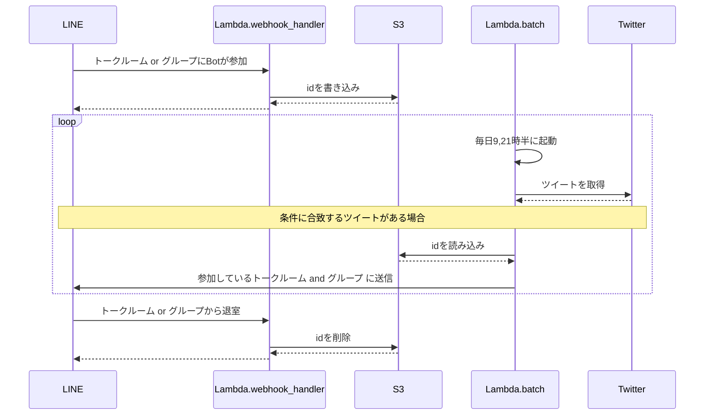

# dbd_line_bot
Dbd official tweet to LINE Talk room and Group by LINE Bot + Twitter API + AWS

## architecture

## system flow

```mermaid
sequenceDiagram
  LINE ->> Lambda.webhook_handler: トークルーム or グループにBotが参加
  Lambda.webhook_handler ->> S3: idを書き込み
  S3 -->> Lambda.webhook_handler: 
  Lambda.webhook_handler -->> LINE: 
  loop
    Lambda.batch ->> Lambda.batch: 毎日9,21時半に起動
    Lambda.batch ->> Twitter: ツイートを取得
    Twitter -->> Lambda.batch: 
    Note over LINE,Twitter: 条件に合致するツイートがある場合
    Lambda.batch ->> S3: idを読み込み
    S3 -->> Lambda.batch: 
    Lambda.batch ->> LINE: 参加しているトークルーム and グループ に送信
  end
  LINE ->> Lambda.webhook_handler: トークルーム or グループから退室
  Lambda.webhook_handler ->> S3: idを削除
  S3 -->> Lambda.webhook_handler: 
  Lambda.webhook_handler -->> LINE: 
```

## deploy flow

